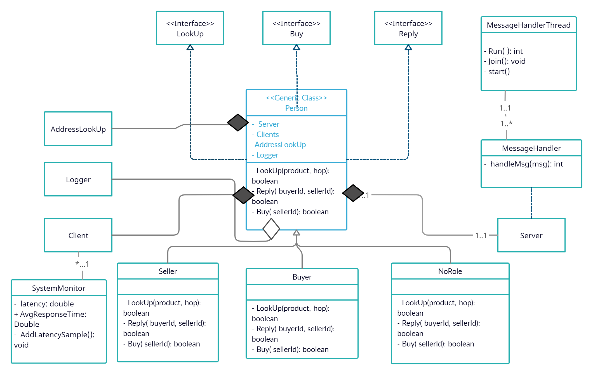

# My Bazaar Design Doc

Authors: Chih-Che Fang, Shivam Srivastava, Shiyang Wang

# Problem description

This project is a simple distributed program implement a peer-to-peer market, The bazaar contains two types of people (i.e., computing nodes): buyers and sellers. Each seller sells one of the following goods: fish, salt, or boars. Each buyer in the bazaar is looking to buy one of these three items.
Buyers find sellers by announcing what they wish to buy or sell. All  announcements must follow the peer-to-peer model. Each buyer shall communicate their needs to all her neighbors, who will then propagate the message to their neighbors and so on, until a seller is found or the maximum limit on the number of hops a message can traverse is reached.
If a seller is found, then the seller sends back a response that traverses in the reverse direction back to the buyer. At this point, the buyer and the seller directly enter into a transaction (without using intermediate peers).

# Design considerations

This project is written in Java and it has strictly implemented three interfaces 
```
lookup (product_name,hopcount)
reply(buyerID, sellerID)
buy(sellerID)
```
in `src/action/LookUp.java`, `src/action/Reply.java` and `src/action/Buy.java` 
and in roles we define a class called Person to implement those three interfaces and 
also extended two child class from Person called Buyer and Seller.
Person could be both server and client since both Buyer and Seller need to either 
do reply or lookup and relay messages, so we defined another 5 classes included in the Person class.

```
AddressLookUp: read global hosts IP/Port configuration in config.txt.
Client: xml-rpc client.
MessageHandler: xml-rpc reciver handler. (included in the Server class)
HandlerThread: used to handel multithread for MessageHandler.
Server: xml-rpc server implementation also to register MessageHandler. 
```




# Design tradeoffs


# Possible improvements and extensions